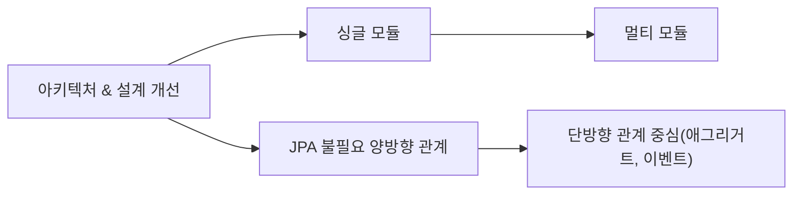
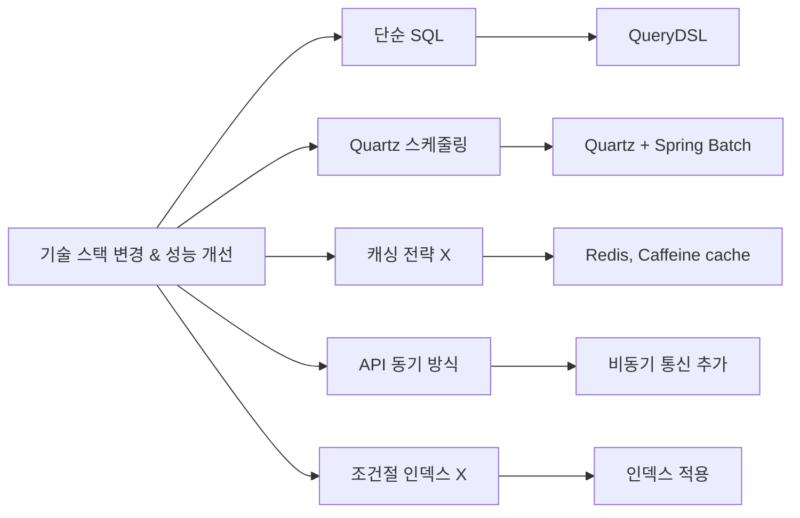
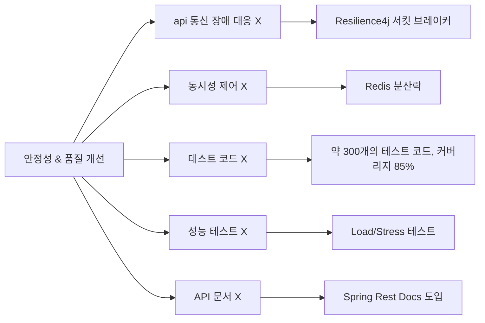
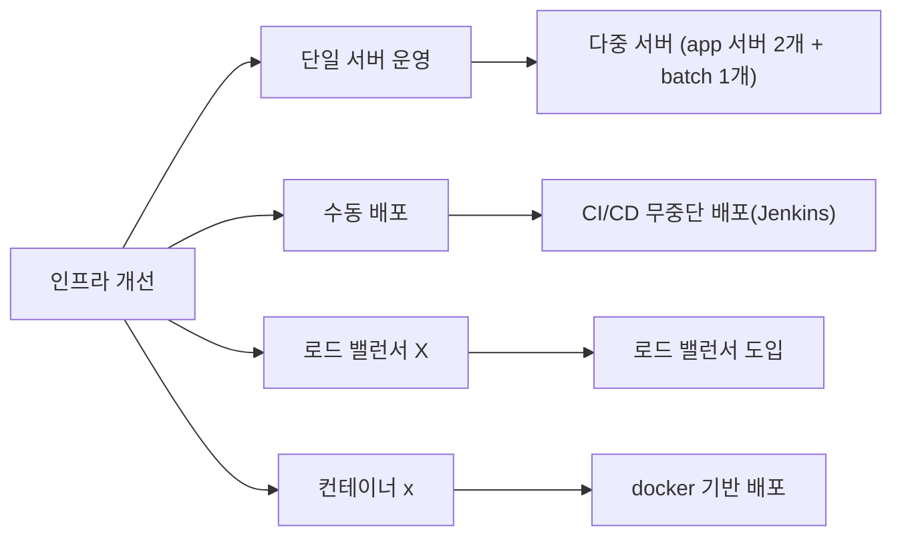

# 최민석 | 백엔드 개발자
📩 E-mail : [choizz156@gmail.com](choizz156@gmail.com)

📚 Blog: https://choizz.tistory.com

---
> **부트캠프 프로젝트를 실운영 수준으로**
> 
> 부트캠프 팀 프로젝트에서는 주로 기능 구현에만 집중했습니다.
> 하지만 실제 서비스 운영에는 성능, 안정성, 관리가 필요하다는 것을 알았습니다.
> 이에 해당 프로젝트를 실운영 수준으로 개선해보기로 했습니다. 전체 도메인 구조와 서버 로직을 파악한 후, 개인적으로 시스템 전반을 리팩토링하고 개선했습니다.
> 그 결과 도메인 설계 개선, 성능 최적화, CI/CD 파이프라인 구축, 모니터링 시스템 도입 등을 경험하며 실무에 필요한 기술들을 학습할 수 있었습니다.

# Pillivery (지속적 개발 및 개선: 2022 - 현재)
- Pillivery는 건강기능식품 온라인 주문 및 정기 결제/배송 플랫폼으로, 초기 팀 프로젝트 이후 개인적으로 실제 서비스 수준의 아키텍쳐와 성능을 목표로 지속 개선 중
- 건강기능식품 온라인 주문 및 **정기 결제/배송** 플랫폼을 목표
    - 건강기능식품 공공 데이터 활용
- 실제 서비스 수준의 건강기능식품 온라인 플랫폼 구현(실제 서비스 X)
- 비용 문제로 현재 배포 중단


## 기술 스택

### Back-end

| 카테고리           | 기술 스택                                                                                    |
|----------------|------------------------------------------------------------------------------------------|
| **언어 & 빌드 도구** | Java 11, Gradle 7.5.1                                                                    |
| **프레임워크**      | Spring Boot 2.7.5, Spring Data JPA/JDBC, Spring Security, Spring Batch, Spring Rest Docs |
| **인증/인가**      | JWT, OAuth 2.0                                                                           |
| **데이터베이스**     | MySQL 8.0                                                                                |
| **캐시**         | Redis (Redisson), Caffeine Cache                                                         |
| **인프라**        | NCP, Vultr, Docker, Jenkins, Nginx, Resilience4j                                         |
| **모니터링 & 로깅**  | Promtail, Loki, Prometheus, Grafana, cAdvisor                                            |
| **테스트**        | JUnit 5, Mockito, WireMock, RestAssured, FixtureMonkey                                   |
| **성능 테스트**     | Locust                                                                                   |
| **HTTP 클라이언트** | WebClient, RestTemplate                                                                  |
| **기타**         | Quartz, EmbeddedRedis                                                                    |

## 1. 개선 전 팀 프로젝트 초기 개발(2022. 11 ~ 2022.12)

- 팀 프로젝트 참여 인원: 7명(FE: 4명, BE: 3명)
- 3인 백엔드 팀에서 **핵심 기능 구현** 담당
    
    (1) 인증/인가 시스템 구축(Spring Security, JWT, OAuth 2.0)
    
    (2) 외부 결제 API 연동 (카카오페이)
    
    (3) 정기 결제 시스템 구축(Quartz)
---

## 2. 개인 리팩토링 작업(~ 현재)

### 📊 프로젝트 개선 사항




### **2.1 싱글 모듈 → 멀티 모듈 전환을 통한 빌드 시간 단축과 확장성 확보**

- 빌드 시간 단축**(전체 빌드 시간 110s → API 모듈 54s, Batch 모듈 25s)**
- **모듈 간 결합도 최소화로 확장성 고려**
- **단방향으로 의존성 관리**
  

#### 2.1.1 모듈 종류

    ├── module-api : 사용자 API 로직
    ├── module-batch : 정기 결제 batch 로직
    ├── module-core : 도메인 및 비지니스 로직
    ├── module-event : 이벤트 저장 및 발행 로직
    ├── module-external-api :외부 API 통신 로직
    ├── module-logging : 로깅 관련 공통 모듈
    ├── module-redis : 분산 락, refresh token 로직

### 2.2 ERD 및 커넥션 풀 설정
도메인 특성 상 카테고리 변경 가능성이 매우 적다는 판단 하에 AttributeConverter를 사용하여 한 컬럼에 다중 카테고리 속성 저장


- category 테이블과 연관관계 제거 → category 테이블과 join 하지 않음
- JPA의 @ElementCollection을 이용한 item_category 생성

#### 2.2.1 논리적 ERD


#### 2.2.2 HikariCP 설정

- MySQL 커넥션 설정보다 낮게 설정돼있는 것은 기본값을 사용
  - 최대 커넥션 풀 크기, 최소 유휴 커넥션 개수, 최대 유휴 시간, 최대 유지 시간, 유효성 검사 주기
- 커넥션 대기 시간(connection-timeout): HikariCP 기본값(30분)보다 낮은 3초로 설정하여 유저에게 빠른 피드백
  


### 2.3 인프라 아키텍처 및 배포 개선

> Client → EC2 → RDS의 단순 3-tier → 확장성과 운영 효율성을 고려한 아키텍처로 개선

- 구성

    - private 서브넷: 비즈니스 서버 2개, 배치 서버 1개, DB 서버 1개
    - public 서브넷: 로드 밸런서, Bastion 서버, 모니터링 서버
    - Bastion 서버를 통한 private 서버 관리


#### 2.3.1 아키텍처 개선

**(1) 보안성 강화**

- Bastion Host 도입
  - 서비스 정상 트래픽과 관리자용 트래픽을 분리
  - 터미널 접근을 위한 키 관리, 작업 감사로그 수집 및 보안 구성
  - 악성코드 감염 시에도 Bastion만 재구성하면 되므로 서비스 영향 최소화


**(2) 트래픽 분산 및 안정성** 

- 로드밸런서(ALB) 적용
  - 로드밸런스 서브넷만 포트 개방(443/80) → Nginx/WAS는 Private Subnet에 격리
  - 최소 연결 수 기반 트래픽 분산
  - SSL/TLS Offloding으로 암호화 오버헤드 제거
  - 헬스체크로 Nginx 장애 시 트래픽 전달 중단하여 장애 전파 방지
    
 
**(3) Nginx 리버스 프록시 적용**

- Sticky Session 적용
  - 장바구니 API 경로에 적용
  - 캐시에 저장돼있는 데이터 불일치 문제 해결

    <details>
      <summary>설정</summary>
        
    ```bash
    
        # ... 생략
        
          upstream app_sticky {
                server <app 서버 1 ip>:8080;
                server <app 서버 2 ip>:8080;
                sticky name=srv_id expires=1h domain=pillivery path=/api/carts;
                keepalive 10;
            }
        
        server {
          listen 80;
          location ^~ /api/carts {
              proxy_pass http://app_sticky;
         			#... 생략
          }
        }
        
        #... 생략
    
    ```
    </details>

- IP 접근 제한
  - 정기 결제 승인 API에서  IP를 내부 서버 IP만으로 제한


     <details>
          <summary>설정</summary>
            
     ```bash
        
            # ... 생략
            
              upstream app_sticky {
                    server <app 서버 1 ip>:8080;
                    server <app 서버 2 ip>:8080;
                    sticky name=srv_id expires=1h domain=pillivery path=/api/carts;
                    keepalive 10;
                }
            
            server {
              listen 80;
              location ^~ /api/carts {
                  proxy_pass http://app_sticky;
             			#... 생략
              }
            }
            
            #... 생략
        
    ```
    </details>
    
- 성능 최적화
    - 네트워크 부하 감소를 위한 Json 응답을 gzip로 압축


**(4) 비용 최적화**

- Lamda, NCP API를 통한 Batch Server 가동
  - 배치 작업 시에만 NCP API로 Batch Server VM을 작동시켜 비용 최소화
  - Lamda, EventBridge으로 cron 스케줄링을 설정
  - NCP API를 호출하여 Batch 서버 VM을 작동
  - 정상 종료 시 VM 내부의 스크립트를 통해 종료
  - Error 로그를 통한 즉각적인 알람 설정

<details>
  <summary>스크립트</summary>
            
     ```bash
        
            #!/bin/bash

            LOG_FILE="/var/log/app_execution.log"
            
            log_message() {
            local timestamp=$(date "+%Y-%m-%d %H:%M:%S")
            echo "[$timestamp] $1" >> $LOG_FILE
            echo "[$timestamp] $1"
            }
            
            JAR_FILE="/root/module-batch-boot.jar"
            PROFILE="batch"
            
            log_message "애플리케이션 실행 시작"
            java -jar -Dspring.profiles.active=$PROFILE $JAR_FILE
            
            EXIT_CODE=$?
            log_message "애플리케이션 종료 코드: $EXIT_CODE"
            
            if [ $EXIT_CODE -eq 0 ]; then
            log_message "애플리케이션이 정상적으로 종료되었습니다. VM 종료를 진행합니다."
            sudo shutdown -h now
            else
            log_message "batch 에러 발생 - 확인 필요"
            fi
            
            log_message "스크립트 실행 완료"
            exit 0    

        
    ```
    </details>


#### 2.3.2 배포 개선 및 CI/CD 적용

**(1) 컨테이너화** 

- Docker 멀티 스테이지 빌드
- 빌드 환경과 실행 환경 분리(경량화된 JRE 환경에서만 실행)
- 컨테이너 이미지 크기 56% 최적화 (1.2GB → 531.5MB, 약 56%)
- 인프라 환경의 일관성 확보

<details>
      <summary>api.dockerfile</summary>
            
     ```dockerfile
        
          FROM gradle:jdk11 AS build

          WORKDIR /app

          COPY --chown=gradle:gradle build.gradle settings.gradle gradlew ./
          COPY --chown=gradle:gradle gradle/ ./gradle/
          COPY --chown=gradle:gradle deploy_script/ ./deploy_script/ #(배포 스크립트)
          COPY --chown=gradle:gradle . .
        
          RUN ./gradlew clean :module-api:build --parallel
        
        
          FROM openjdk:11.0.16-jre-slim-buster
          
          WORKDIR /app
          
          COPY --from=build /app/module-api/build/libs/module-api-boot.jar app.jar
        
          ENTRYPOINT ["java", "-jar", "-Dspring.profiles.active=prod", "app.jar"]

        
    ```
</details>

<details>
  <summary>batch.dockerfile</summary>
            
     ```dockerfile
        
           FROM gradle:jdk11 AS build

          WORKDIR /app
    
          COPY --chown=gradle:gradle build.gradle settings.gradle gradlew ./
          COPY --chown=gradle:gradle gradle/ ./gradle/
          COPY --chown=gradle:gradle deploy_script/ ./deploy_script/
          COPY --chown=gradle:gradle . .
        
          RUN ./gradlew clean :module-batch:build --parallel
        
        
          FROM openjdk:11.0.16-jre-slim-buster
        
          WORKDIR /app
        
          COPY --from=build /app/module-api/build/libs/module-batch-boot.jar app.jar
        
          ENTRYPOINT ["java", "-jar", "-Dspring.profiles.active=batch", "app.jar"]
        
    ```
</details>

**(2) 무중단 CI/CD 파이프라인(Rolling)**

> **기술 선택 이유**
>
> - **Jenkins:** business, batch 두 개의 파이프라인 설정 필요성
> - **Docker, Container Registry:** Container Registry를 통한 **도커 이미지 버전 관리** 가능

- **내용**
  - Bastion 호스트를 통한 Private 서브넷 배포
  - 빌드 시 테스트(CI), 배포 후 헬스 체크(CD)
  - Slack을 통한 배포 알람 설정


- **Jenkins Pipeline stage 종류**

  - check out

  - git 정보 및 환경 설정

  - Docker 이미지 빌드(CI)

  - Docker 이미지 Container Registry에 푸시

  - 서버내 스크립트로 배포 및 헬스 체크(CD)

  - Slack 알람(성공/실패)


