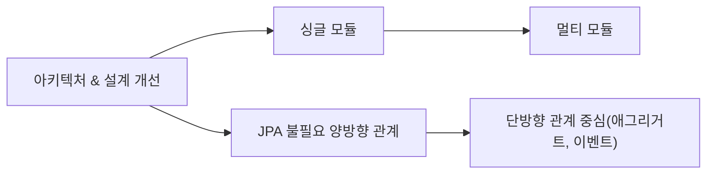
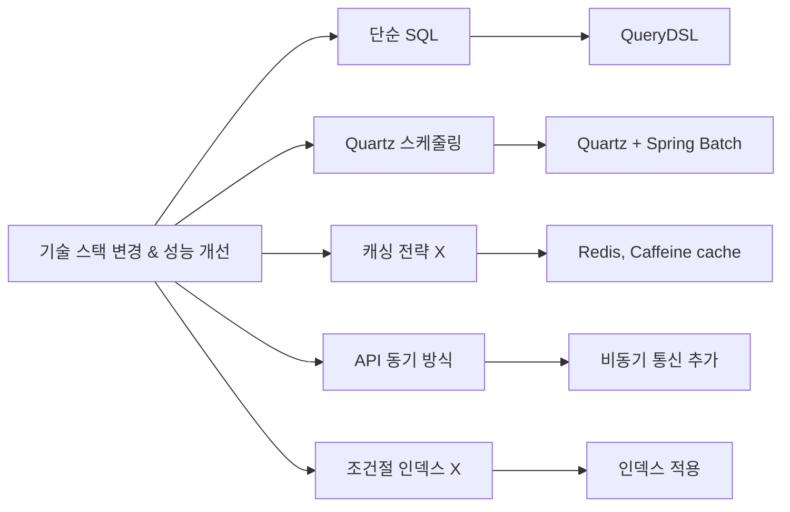
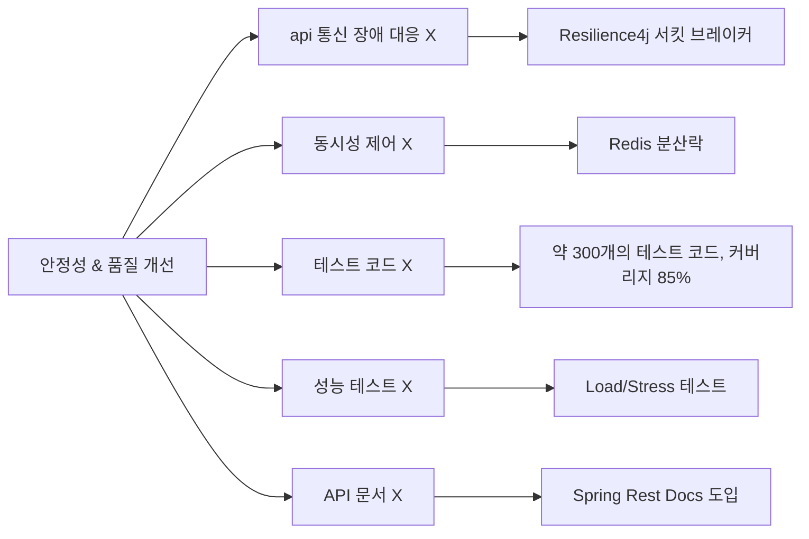
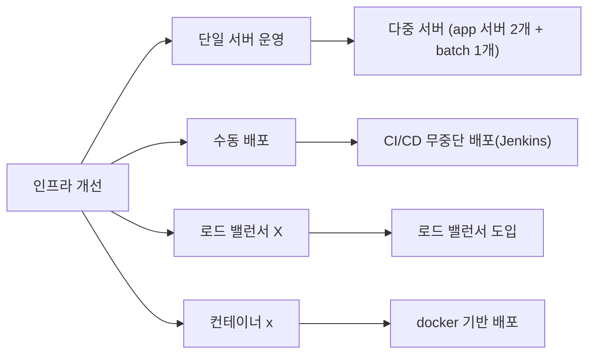

# 최민석 | 백엔드 개발자
Java/Spring 기반의 백엔드 개발자로서 성능 최적화와 고가용성 인프라 구축, 테스트 코드의 중요성을 깊이 인식하고 있습니다.</br>
이를 위해 코드 리뷰 교육에 참여하여 현업 개발자들과의 코드 리뷰를 경험했습니다.</br> 
이 과정을 통해 테스트 코드 작성의 중요성과 인프라 구성에 대한 실질적인 지식은 물론, 협업과 커뮤니케이션의 방식도 함께 배울 수 있었습니다.</br>

📩 E-mail : [choizz156@gmail.com](choizz156@gmail.com)

📚 Blog: https://choizz.tistory.com


---
> **팀 프로젝트를 실운영 수준으로**
> 
> 프로젝트에서는 주로 기능 구현에만 집중했습니다. 하지만, 실제 서비스 운영에는 성능, 안정성, 관리가 필요하다는 것을 알았습니다.</br>
> 이에 해당 프로젝트를 실운영 수준으로 개선해보기로 했습니다. </br>
> 전체 도메인 구조와 서버 로직을 파악한 후, 개인적으로 시스템 전반을 리팩토링하고 개선했습니다.</br>
> 그 결과 도메인 설계 개선, 성능 최적화, CI/CD 파이프라인 구축, 모니터링 시스템 도입 등을 경험하며 실무에 필요한 기술들을 학습할 수 있었습니다.

# 목차
* [1. 개선 전 팀 프로젝트 초기 개발(2022. 11 ~ 2022.12)](#1-개선-전-팀-프로젝트-초기-개발2022-11--202212)
* [2. 개인 리팩토링 작업(~ 현재)](#2-개인-리팩토링-작업-현재)
    * [📊 프로젝트 개선 사항](#-프로젝트-개선-사항)
  * [2.1 싱글 모듈 → 멀티 모듈 전환을 통한 빌드 시간 단축과 확장성 확보](#21-싱글-모듈--멀티-모듈-전환을-통한-빌드-시간-단축과-확장성-확보)
    * [2.1.1 모듈 종류](#211-모듈-종류)
  * [2.2 ERD 및 커넥션 풀 설정](#22-erd-및-커넥션-풀-설정)
    * [2.2.1 논리적 ERD](#221-논리적-erd)
    * [2.2.2 HikariCP 설정](#222-hikaricp-설정)
  * [2.3 인프라 아키텍처 및 배포 개선](#23-인프라-아키텍처-및-배포-개선)
    * [2.3.1 아키텍처 개선](#231-아키텍처-개선)
      * [(1) 보안성 강화](#1-보안성-강화)
      * [(2) 트래픽 분산 및 안정성](#2-트래픽-분산-및-안정성)
      * [(3) Nginx 리버스 프록시 적용](#3-nginx-리버스-프록시-적용)
      * [(4) 비용 최적화](#4-비용-최적화)
    * [2.3.2 배포 개선 및 CI/CD 적용](#232-배포-개선-및-cicd-적용)
      * [(1) 컨테이너화](#1-컨테이너화)
      * [(2) 무중단 CI/CD 파이프라인(Rolling)](#2-무중단-cicd-파이프라인rolling)
    * [2.3.3 모니터링 시스템 구축](#233-모니터링-시스템-구축)
      * [(1) 메트릭 모니터링](#1-메트릭-모니터링)
      * [(2) 로그 관리](#2-로그-관리)
      * [(3) 알림 시스템](#3-알림-시스템)
  * [2.4 도메인 개선 및 리팩토링](#24-도메인-개선-및-리팩토링)
    * [2.4.1 도메인 모델 개선](#241-도메인-모델-개선)
      * [(1) 연관관계 개선](#1-연관관계-개선)
      * [(2) 도메인 책임 분리](#2-도메인-책임-분리)
    * [2.4.2 기술 스택 보완](#242-기술-스택-보완)
      * [(1) QueryDsl 도입](#1-querydsl-도입)
      * [(2) Spring Rest Docs 도입](#2-spring-rest-docs-도입)
      * [(3) Redis의 HyperLogLog를 활용한 조회 수 계산](#3-redis의-hyperloglog를-활용한-조회-수-계산)
    * [2.4.3 이벤트 기반 아키텍처 도입](#243-이벤트-기반-아키텍처-도입)
      * [(1) 이벤트 적용](#1-이벤트-적용)
      * [(2) 비동기 이벤트 저장소를 통한 서버와 외부 API 통신 트랜잭션 분리](#2-비동기-이벤트-저장소를-통한-서버와-외부-api-통신-트랜잭션-분리)
    * [2.4.4 다중 서버에서 동시성 문제 해결](#244-다중-서버에서-동시성-문제-해결)
      * [(1) 분산 환경을 고려한 Redis 분산 락(Distributed Lock) 적용](#1-분산-환경을-고려한-redis-분산-락distributed-lock-적용)
    * [2.4.5 캐싱 전략 도입](#245-캐싱-전략-도입)
      * [(1) 변경에 민감하지 않고 자주 조회되는 아이템 로컬 캐싱(카테고리, 할인 중 ..)](#1-변경에-민감하지-않고-자주-조회되는-아이템-로컬-캐싱카테고리-할인-중-)
    * [2.4.6 확장 가능한 시스템 설계](#246-확장-가능한-시스템-설계)
      * [(1) 확장 가능한 결제 시스템](#1-확장-가능한-결제-시스템)
    * [2.4.7 테스트를 통한 코드 품질 관리 및 운영 가시성 개선](#247-테스트를-통한-코드-품질-관리-및-운영-가시성-개선)
      * [(1) 테스트 코드 기반 코드 품질 관리](#1-테스트-코드-기반-코드-품질-관리)
      * [(2) AOP와 MDC를 통한 로깅 시스템 구축](#2-aop와-mdc를-통한-로깅-시스템-구축)
* [3. 기술적 도전](#3-기술적-도전)
  * [3.1 외부 API 장애 격리: Circuit Breaker와 BulkHead(Resilience4j)](#31-외부-api-장애-격리-circuit-breaker와-bulkheadresilience4j)
    * [3.1.1 주요 설계](#311-주요-설계)
      * [(1) 장애 감지 및 차단](#1-장애-감지-및-차단)
      * [(2) Retry 설정](#2-retry-설정)
      * [(3) 네트워크 커넥션 풀 설정 및 동시 요청 수 제한](#3-네트워크-커넥션-풀-설정-및-동시-요청-수-제한)
      * [(4) Fast-Fail 응답 처리](#4-fast-fail-응답-처리)
    * [3.1.2 Circuit Breaker 기능 테스트](#312-circuit-breaker-기능-테스트)
      * [(1) Closed 상태**(초기 정상)](#1-closed-상태초기-정상)
      * [(2) Open 상태(장애 감지 및 차단)](#2-open-상태장애-감지-및-차단)
      * [(3) Half-Open 상태(복구 시도)](#3-half-open-상태복구-시도)
    * [3.1.3 Retry 안정성 테스트](#313-retry-안정성-테스트)
    * [3.2 정기 결제 로직 고도화: Spring Scheduled → Quartz → Spring Batch](#32-정기-결제-로직-고도화-spring-scheduled--quartz--spring-batch)
      * [**Phase 1: 최초 @Scheduled 사용**](#phase-1-최초-scheduled-사용)
      * [**Phase 2: Quartz로 개선**](#phase-2-quartz로-개선)
      * [**Phase 3: Spring Batch 기반 재설계**](#phase-3-spring-batch-기반-재설계)
* [4. 부하 테스트를 통한 성능 개선 및 문제 해결](#4-부하-테스트를-통한-성능-개선-및-문제-해결)
    * [4.1 테스트 환경](#41-테스트-환경)
    * [4.2 사용자 트래픽 분석 기반한 성능 목표 설정](#42-사용자-트래픽-분석-기반한-성능-목표-설정)
  * [4.3  Profile & Explain을 통한 조회 쿼리 성능 개선](#43--profile--explain을-통한-조회-쿼리-성능-개선)
    * [4.3.1. 인덱스 → 조회 쿼리 성능 개선](#431-인덱스--조회-쿼리-성능-개선)
    * [4.3.2. 단건 조회 N + 1 문제 → DTO 성능 개선](#432-단건-조회-n--1-문제--dto-성능-개선)
  * [4.4 결제 승인 테스트 → DB 커넥션 풀(HikariCP) 부족 문제 해결](#44-결제-승인-테스트--db-커넥션-풀hikaricp-부족-문제-해결)
  * [4.5 장바구니 API Test → 로컬 캐싱을 통한 성능 개선](#45-장바구니-api-test--로컬-캐싱을-통한-성능-개선)
      * [4.5.1 로컬 캐싱 → 성능 개선](#451-로컬-캐싱--성능-개선)
    * [**4.5.2 방어적 복사 → 데이터 정합성 확보**](#452-방어적-복사--데이터-정합성-확보)
<!-- TOC -->

# Pillivery (7인 팀 프로젝트, 백엔드 3명 / 2022.12 ~)
- 건강기능식품 온라인 주문 및 정기 결제/배송 플랫폼으로, 초기 팀 프로젝트 이후 개인적으로 실제 서비스 수준의 아키텍쳐와 성능을 목표로 지속 개선 중
- 실제 서비스 운영 환경을 가정한 아키텍처 설계 및 구현
- 팀 개발 완료 후 개인 주도의 지속적인 개선 작업을 통한 실무 역량 강화
- 비용 문제로 현재 배포 중단
- [API 문서](https://pillivery-api.pages.dev/)

**기술 스택**

| 카테고리           | 기술 스택                                                                                    |
|----------------|------------------------------------------------------------------------------------------|
| **언어 & 빌드 도구** | Java 11, Gradle 7.5.1                                                                    |
| **프레임워크**      | Spring Boot 2.7.5, Spring Data JPA/JDBC, Spring Security, Spring Batch, Spring Rest Docs |
| **인증/인가**      | JWT, OAuth 2.0                                                                           |
| **데이터베이스**     | MySQL 8.0                                                                                |
| **캐시**         | Redis (Redisson), Caffeine Cache                                                         |
| **인프라**        | NCP, Vultr, Docker, Jenkins, Nginx, Resilience4j                                         |
| **모니터링 & 로깅**  | Promtail, Loki, Prometheus, Grafana, cAdvisor                                            |
| **테스트**        | JUnit 5, Mockito, WireMock, RestAssured, FixtureMonkey                                   |
| **성능 테스트**     | Locust                                                                                   |
| **HTTP 클라이언트** | WebClient, RestTemplate                                                                  |
| **기타**         | Quartz, EmbeddedRedis                                                                    |

# 1. 개선 전 팀 프로젝트 초기 개발(2022. 11 ~ 2022.12)

- 3인 백엔드 팀에서 **핵심 기능 구현** 담당
    
   - 유저 도메인 Restful API 개발
	- 카카오페이 API 연동 결제 기능 개발
	- JWT, OAuth 2.0 기반 인증/인가 시스템 구축 (Spring Security)
	- Quartz 기반 정기 결제 시스템 개발
---

# 2. 개인 리팩토링 작업(~ 현재)

### 📊 프로젝트 개선 사항




## **2.1 싱글 모듈 → 멀티 모듈 전환을 통한 빌드 시간 단축과 확장성 확보** 
> [싱글 모듈에서 멀티 모듈로 전환한 이유와 장단점 블로깅](https://choizz.tistory.com/47)

- 빌드 시간 단축**(전체 빌드 시간 110s → API 모듈 54s, Batch 모듈 25s)**
- **모듈 간 결합도 최소화로 확장성 고려**
- **단방향으로 의존성 관리**
  

### 2.1.1 모듈 종류

    ├── module-api : 사용자 API 로직
    ├── module-batch : 정기 결제 batch 로직
    ├── module-core : 도메인 및 비지니스 로직
    ├── module-event : 이벤트 저장 및 발행 로직
    ├── module-external-api :외부 API 통신 로직
    ├── module-logging : 로깅 관련 공통 모듈
    ├── module-redis : 분산 락, refresh token 로직

## 2.2 ERD 및 커넥션 풀 설정
도메인 특성 상 카테고리 변경 가능성이 매우 적다는 판단 하에 AttributeConverter를 사용하여 한 컬럼에 다중 카테고리 속성 저장


- category 테이블과 연관관계 제거 → category 테이블과 join 하지 않음
- JPA의 @ElementCollection을 이용한 item_category 생성

### 2.2.1 논리적 ERD


### 2.2.2 HikariCP 설정

- MySQL 커넥션 설정보다 낮게 설정돼있는 것은 기본값을 사용
  - 최대 커넥션 풀 크기, 최소 유휴 커넥션 개수, 최대 유휴 시간, 최대 유지 시간, 유효성 검사 주기
- 커넥션 대기 시간(connection-timeout): HikariCP 기본값(30분)보다 낮은 3초로 설정하여 유저에게 빠른 피드백
  
---

## 2.3 인프라 아키텍처 및 배포 개선

> Client → EC2 → RDS의 단순 3-tier → 확장성과 운영 효율성을 고려한 아키텍처로 개선

- 구성

    - private 서브넷: 비즈니스 서버 2개, 배치 서버 1개, DB 서버 1개
    - public 서브넷: 로드 밸런서, Bastion 서버, 모니터링 서버
    - Bastion 서버를 통한 private 서버 관리


### 2.3.1 아키텍처 개선

#### (1) 보안성 강화

- Bastion Host 도입
  - 서비스 정상 트래픽과 관리자용 트래픽을 분리
  - 터미널 접근을 위한 키 관리, 작업 감사로그 수집 및 보안 구성
  - 악성코드 감염 시에도 Bastion만 재구성하면 되므로 서비스 영향 최소화


#### (2) 트래픽 분산 및 안정성

- 로드밸런서(ALB) 적용
  - 로드밸런스 서브넷만 포트 개방(443/80) → Nginx/WAS는 Private Subnet에 격리
  - 최소 연결 수 기반 트래픽 분산
  - SSL/TLS Offloding으로 암호화 오버헤드 제거
  - 헬스체크로 Nginx 장애 시 트래픽 전달 중단하여 장애 전파 방지
    
 
#### (3) Nginx 리버스 프록시 적용

- Sticky Session 적용
  - 장바구니 API 경로에 적용
  - 캐시에 저장돼있는 데이터 불일치 문제 해결

    <details>
      <summary>설정</summary>
        
    ```bash
    
        # ... 생략
        
          upstream app_sticky {
                server <app 서버 1 ip>:8080;
                server <app 서버 2 ip>:8080;
                sticky name=srv_id expires=1h domain=pillivery path=/api/carts;
                keepalive 10;
            }
        
        server {
          listen 80;
          location ^~ /api/carts {
              proxy_pass http://app_sticky;
         			#... 생략
          }
        }
        
        #... 생략
    
    ```
    </details>

- IP 접근 제한
  - 정기 결제 승인 API에서  IP를 내부 서버 IP만으로 제한


     <details>
          <summary>설정</summary>
            
     ```bash
        
            # ... 생략
            
              upstream app_sticky {
                    server <app 서버 1 ip>:8080;
                    server <app 서버 2 ip>:8080;
                    sticky name=srv_id expires=1h domain=pillivery path=/api/carts;
                    keepalive 10;
                }
            
            server {
              listen 80;
              location ^~ /api/carts {
                  proxy_pass http://app_sticky;
             			#... 생략
              }
            }
            
            #... 생략
        
    ```
    </details>
    
- 성능 최적화
    - 네트워크 부하 감소를 위한 Json 응답을 gzip로 압축


#### (4) 비용 최적화

- Lamda, NCP API를 통한 Batch Server 가동
  - 배치 작업 시에만 NCP API로 Batch Server VM을 작동시켜 비용 최소화
  - Lamda, EventBridge으로 cron 스케줄링을 설정
  - NCP API를 호출하여 Batch 서버 VM을 작동
  - 정상 종료 시 VM 내부의 스크립트를 통해 종료
  - Error 로그를 통한 즉각적인 알람 설정

<details>
  <summary>스크립트</summary>
            
     ```bash
        
            #!/bin/bash

            LOG_FILE="/var/log/app_execution.log"
            
            log_message() {
            local timestamp=$(date "+%Y-%m-%d %H:%M:%S")
            echo "[$timestamp] $1" >> $LOG_FILE
            echo "[$timestamp] $1"
            }
            
            JAR_FILE="/root/module-batch-boot.jar"
            PROFILE="batch"
            
            log_message "애플리케이션 실행 시작"
            java -jar -Dspring.profiles.active=$PROFILE $JAR_FILE
            
            EXIT_CODE=$?
            log_message "애플리케이션 종료 코드: $EXIT_CODE"
            
            if [ $EXIT_CODE -eq 0 ]; then
            log_message "애플리케이션이 정상적으로 종료되었습니다. VM 종료를 진행합니다."
            sudo shutdown -h now
            else
            log_message "batch 에러 발생 - 확인 필요"
            fi
            
            log_message "스크립트 실행 완료"
            exit 0    

        
    ```
</details>

---

### 2.3.2 배포 개선 및 CI/CD 적용

#### (1) 컨테이너화

- Docker 멀티 스테이지 빌드
- 빌드 환경과 실행 환경 분리(경량화된 JRE 환경에서만 실행)
- 컨테이너 이미지 크기 56% 최적화 (1.2GB → 531.5MB, 약 56%)
- 인프라 환경의 일관성 확보

<details>
      <summary>api.dockerfile</summary>
            
     ```dockerfile
        
          FROM gradle:jdk11 AS build

          WORKDIR /app

          COPY --chown=gradle:gradle build.gradle settings.gradle gradlew ./
          COPY --chown=gradle:gradle gradle/ ./gradle/
          COPY --chown=gradle:gradle deploy_script/ ./deploy_script/ #(배포 스크립트)
          COPY --chown=gradle:gradle . .
        
          RUN ./gradlew clean :module-api:build --parallel
        
        
          FROM openjdk:11.0.16-jre-slim-buster
          
          WORKDIR /app
          
          COPY --from=build /app/module-api/build/libs/module-api-boot.jar app.jar
        
          ENTRYPOINT ["java", "-jar", "-Dspring.profiles.active=prod", "app.jar"]

        
    ```
</details>

<details>
  <summary>batch.dockerfile</summary>
            
     ```dockerfile
        
           FROM gradle:jdk11 AS build

          WORKDIR /app
    
          COPY --chown=gradle:gradle build.gradle settings.gradle gradlew ./
          COPY --chown=gradle:gradle gradle/ ./gradle/
          COPY --chown=gradle:gradle deploy_script/ ./deploy_script/
          COPY --chown=gradle:gradle . .
        
          RUN ./gradlew clean :module-batch:build --parallel
        
        
          FROM openjdk:11.0.16-jre-slim-buster
        
          WORKDIR /app
        
          COPY --from=build /app/module-api/build/libs/module-batch-boot.jar app.jar
        
          ENTRYPOINT ["java", "-jar", "-Dspring.profiles.active=batch", "app.jar"]
        
    ```
</details>


#### (2) 무중단 CI/CD 파이프라인(Rolling)

> **기술 선택 이유**
>
> - **Jenkins:** business, batch 두 개의 파이프라인 설정 필요성
> - **Docker, Container Registry:** Container Registry를 통한 **도커 이미지 버전 관리** 가능

- **내용**
  - Bastion 호스트를 통한 Private 서브넷 배포
  - 빌드 시 테스트(CI), 배포 후 헬스 체크(CD)
  - Slack을 통한 배포 알람 설정


- **Jenkins Pipeline stage 종류**

  - check out

  - git 정보 및 환경 설정

  - Docker 이미지 빌드(CI)

  - Docker 이미지 Container Registry에 푸시

  - 서버내 스크립트로 배포 및 헬스 체크(CD)

  - Slack 알람(성공/실패)
<div style="display: flex; gap: 10px;">
  
  
</div>

---

### 2.3.3 모니터링 시스템 구축

#### (1) 메트릭 모니터링

- **Prometheus + Grafana**
  - 시스템 정보 수집 및 시각화
  - 실시간 성능 모니터링

#### (2) 로그 관리 

- **Promtail + Loki**
  - 분산 로그 수집
  - 중앙집중식 로그 관리


#### (3) 알림 시스템

- **Slack 연동 알림**
- Error log, Warn log에 대한 알람
  
- CPU 50% 이상(cAdvisor) 시 알람 설정(WAS, MySQL)
  
- Batch 앱의 경우 1개의 Error 로그 시 알림 설정


---

## 2.4 도메인 개선 및 리팩토링

### 2.4.1 도메인 모델 개선

#### (1) 연관관계 개선

- 배경

  - **생명 주기가 다른 도메인** 간 불필요한 **JPA 양방향 관계**로 도메인 결합도 증가
  - 불편한 테스트 데이터 작성

- 개선 내용

  - **단방향 전환:** order ↔ user, review ↔ item, user 관계
  - 생명주기가 다르다고 판단되는 객체 간 **연관관계 최소화**
  - 필요한 경우 외래키 ID만 참조하는 방식으로 변경

- 효과

  - 테스트 용이성 확보
  -  도메인 간 결합도를 낮추고 유연성을 확보
  - cascade 범위 최소화로 예측 가능한 객체 생명주기 관리

    

#### (2) 도메인 책임 분리

- 배경
  - Order 엔티티 하나**로 단건 결제와 정기 결제 도메인에서 **동시에** 사용 
  - **단건 결제와 정기 결제**는 생명주기, 비즈니스 규칙, 데이터 특성이 **완전히 다른 별개 도메인**이라고 판단

- 개선 내용
  - **도메인 분리:** 단건 결제(Order)와 정기 결제(SubscriptionOrder)
  - 각각 도메인의 고유 책임과 비즈니스 규칙 명확화
- 효과
  - 독립적인 기능 확장 가능
  - 도메인 모델의 명확성 향상

---

### 2.4.2 기술 스택 보완

#### (1) QueryDsl 도입

- 배경
  - String 기반 쿼리 작성으로 유지 보수 어려움
  - 쿼리 가독성 저하


- 개선 내용
  - **타입 안전성과 유지보수성 강화:** Native Query에서 QueryDSL로 전환

- 효과
  - 컴파일 타임에 오류를 확인할 수 있어 안정성 향상
  - 복잡한 검색 조건을 유연하게 처리 가능하게 함
  - 쿼리 재사용성과 가독성 향상

    

#### (2) Spring Rest Docs 도입

- 배경
  - 프로덕션 코드에 api 문서 코드가 침투하지 않아야 한다고 판단, Swagger보다 Spring Rest Docs 선택

- 효과
  - 테스트 기반 문서화로 신뢰성 확보
  - 프로덕션 코드에 문서 작성을 위한 코드 침투 방지
  - 변경 사항 발생 시 테스트 실패를 통한 문서 업데이트 필요성 즉시 감지
</br> **[api 문서 링크](https://pillivery-api.pages.dev/)**


#### (3) Redis의 HyperLogLog를 활용한 조회 수 계산

- 배경
  - 아이템 조회마다 조회수 증가 쿼리 추가

- 개선 내용
  - 아이템 조회 시, Redis의 HyperLogLog를 사용하여 합산한 뒤 추후에 한 번에 DB 저장

- 효과
  - 메모리 사용량(12KB)을 최소화하면서도 오차(0.82)가 적은 고유 방문자 수 집계 가능
  - IP 중복 자동 방지
  - 기존 아이템 조회 마다 발생하는 조회 수 증가 쿼리 방지
- **고려 사항**
  - 약간의 데이터 오차가 있지만, 정확성보다 처리 성능을 고려

---

### 2.4.3 이벤트 기반 아키텍처 도입

#### (1) 이벤트 적용

- **배경**

  - 핵심 트랜잭션에 포함되지 않아도 되는 로직이 포함

- 개선 내용

  - 구매 후 장바구니 삭제, 아이템 판매량 증가 등 **핵심 트랜잭션에 포함되지 않아도 되는 로직을 이벤트로 분리하여** **비동기 처리**
  - Spring의 ApplicationEventPublisher 활용
  - @Async 어노테이션을 활용한 비동기 이벤트 처리

- 효과
  - 주요 트랜잭션 처리 시간 및 범위 단축
  - 도메인 간 결합도 감소
  - 기능 확장 시 유연성 확보

- 고려사항
  - 비동기 처리 중 에러 발생 시 로깅 처리

  

#### (2) 비동기 이벤트 저장소를 통한 서버와 외부 API 통신 트랜잭션 분리

> - **비동기 저장소:** 이벤트를 따로 DB에 저장하고 스케쥴링하여 이벤트 처리

- 배경
  - 비동기 이벤트를 발행하고 구독하는데 Kafka나 RabbitMQ 등의 메시지 브로커는 학습 곡선 크다고 판단
  - 외부 API 로직과 서버 로직이 강결합
  - 외부 API 장애 발생 시 서버에 영향 가능성
  
- 개선 사항
  - 주문 취소 처리, 외부 서비스(SID 발급 등) 호출과 같은 **외부 API 연동 로직을 비동기 이벤트로 저장하여 핵심 트랜잭션과 분리**
  - 스케쥴링 기반의 후속 처리 방식 적용

- 효과
  - 핵심 트랜잭션과 부가 트랜잭션을 분리하여 서버 로직과의 결합도를 낮추고 **트랜잭션 범위 최소화**
  - 서버 응답 속도 개선 및 외부 API 장애로부터 핵심 비즈니스 로직 보호

- 고려사항
  - 이벤트 발행 실패 시, 실패 이벤트 따로 저장하여 다음 스케쥴에 재시도
  - 다중 서버에서 이벤트 구독 시, 중복 저장 가능성 → 분산 락으로 해결
    

**결제 플로우**


**SID 비동기 발행 요청 플로우**


---

### 2.4.4 다중 서버에서 동시성 문제 해결


#### (1) 분산 환경을 고려한 Redis 분산 락(Distributed Lock) 적용
> [다중 서버에서 분산 락 사용(feat. Redisson) 블로깅](https://choizz.tistory.com/49)

- 배경
  - 다중 서버 환경에서 이벤트 데이터 중복 저장 가능성
- 개선 내용
  - **데이터 정합성 확보:** 다중 서버 환경에서 비동기 이벤트 저장을 할 때, **중복 저장 방지 및 데이터 정합성**을 고려하여 Redis 분산 락 적용
- 효과
  - 데이터 중복 등록 및 경쟁 조건 해결
  - 비동기 이벤트 저장 로직의 신뢰성과 일관성 확보
- 고려 사항
  - Redis 서버가 다중 서버가 아니므로 Redis 서버에 문제가 발생할 경우, 분산 락이 작동하지 않을 수 있음(SPOF)
  - TTL 설정을 통해 시간이 지난 후 락 해제
  - 추후 다중 인스턴스를 통한 RedLock 고려
  

### 2.4.5 캐싱 전략 도입

#### (1) 변경에 민감하지 않고 자주 조회되는 아이템 로컬 캐싱(카테고리, 할인 중 ..)

- 배경
  - 빈번히 발생하는 API 통신에 DB 부하 증가
  - 낮은 데이터 정보 변경 빈도
- 개선 내용
  - 자주 조회되는 카테고리 아이템, 할인 중 아이템 로컬 캐싱
- 효과
  - API 응답 시간 **약 95% 개선(평균 응답시간 750ms → 28.5ms)**

- 고려 사항
  - **분산 TTL 및 refresh 설정:** Cache Penetration, Cache Avalanche, Hot Key 문제 발생 방지
  
  - **Write Around:** 정보 변경이 자주 일어나지 않는다고 판단하여 DB에 먼저 저장 후 변경 내용 캐시에 저장
  
- 추후 기능 개발 예정
  - 다중 서버에서 캐시 데이터 일치를 위해, 서버1에서 변경 내용 DB 저장 후 캐시를 삭제하고, webhook이나 Redis pub/sub 고려

---

### 2.4.6 확장 가능한 시스템 설계


#### (1) 확장 가능한 결제 시스템

> - 다중 PG사 연동을 고려한 확장 가능한 결제 시스템 구축
> - **개방 폐쇄 원칙(OCP) 적용** → 신규 PG사 추가 시 기존 코드 수정 최소
> - Template Method 패턴, Strategy 패턴, Facade 패턴 복합 활용

**Facade 계층(KakaoPaymentFacade)**

- **기능:** 단건/정기 결제 요청, 단건/정기 결제 승인, 정기 결제 최초 승인 구분 처리

- **효과:** 결제 유형 별 요청 라우팅 및 복잡성 은닉화


**Service 계층**

- 인터페이스 종류:
  - **RequestService**: 단건/정기 결제 요청 로직 메서드 정의
  - **OneTimeApproveService**: 단건 결제 승인 로직 메서드 정의
  - **SubscriptionApproveService**: 정기 결제 승인 로직 메서드 정의

- **로직 캡슐화** : 인터페이스를 구현하여 각 구현 로직 캡슐화

  

**Communication 계층(외부 API 통신 추상화)**

- 인터페이스 종류:

  - **Request:** 단건/정기 결제 요청 외부 API 통신 메서드 정의

  - **OneTimeApprove:** 단건 결제 승인 외부 API 통신 메서드 정의

  - **SubscriptionApprove:** 정기 결제 외부 API 통신 메서드 정의

- **로직 캡슐화** : 인터페이스를 구현하여 각 구현 로직 캡슐화

- **Template Method 패턴 적용 :**  KakaoRequestTemplate, KakaoApproveTemplate(이미지 생략)을 **추상 클래스로 공통 로직 재사용** 

- **API 통신 매개변수**:  ``#getRequestParams()`` 메서드 오버라이드하여 각 로직에 맞는 매개변수 선택 


---

### 2.4.7 테스트를 통한 코드 품질 관리 및 운영 가시성 개선

#### (1) 테스트 코드 기반 코드 품질 관리

> - **코드 품질 보증:** 자동화 테스를 통한 안정적 서비스 운영
> - **개발 생성성 향상:** 빠른 피드백을 통한 효율적 개발

**테스트 결과**

> 모든 **테스트를 격리**하여 병렬 실행

- Test Coverage**: 85%**
- 테스트 개수: **약 340개**

**테스트 도구**

- **FixtureMonkey** 
  - **목적:** 모의 객체 생성 자동화
  - **효과:** 테스트 데이터 생성 시간 단축 및 일관성
- **JUnit5 + Mockito**
  - **목적:** 도메인 테스트 및 통합테스트
- **RestAssured**
  - **목적:** 인수 테스트
  - **효과:** 가독성 높은 API 테스트 코드 작성

- **EmbeddedRedis**
  - **목적:** 로컬 Redis 테스트 환경에 사용
  - **효과:** 외부 의존성 없는 독립적 테스트 환경 수립

**병렬 테스트 효과**

```groovy
./gradlew test --parallel
```

- **테스트 시간 42% 단축:** 120초 → 69초

- 빠른 피드백 환경 구축

- CI 시 전체 빌드 시간 단축

  

#### (2) AOP와 MDC를 통한 로깅 시스템 구축

- **배경**
  - 에러 발생 시, 특정 요청 로그 흐름 파악 필요성
  - 멀티스레드 환경에서 **로그 추적 시스템** 구축 필요성

- **개선 내용**
  - **로그 정보 활용 증대 :** 로그 level 별로 저장
  - **통합 로그 관리 :** Nginx와 애플리케이션의 Request-ID 통일화
- **효과**
  - **특정 요청 로그 흐름 파악 :** Request-ID를 통한 요청 추적
  - **신속한 문제 원인 분석 : **에러 발생 시 해당 Request-ID로 전체 로그 검색

```
┌─────────────┐        ┌─────────────┐
│    Nginx    │  ───▶  │   Service   │
│ Request-ID  │        │ Request-ID  │     
└─────────────┘        └─────────────┘
        │                  │             
        └────────┼─────────┘
                 ▼
   통일된 Request-ID로 요청 흐름 추적
```

**Nignx 로그 설정**


```nginx
...

log_format main '$request_id $remote_addr - $remote_user [$time_local]'
                    '"$request" $status $body_bytes_sent '
                    '"$http_referer" "$request_time" '
                    '"$http_user_agent" "$http_x_forwarded_for"'
                    '"$ssl_protocol/$ssl_cipher" "$content_length"'
                    '"$request_length"';
  ...

 server {
  				...
        location / {
            proxy_pass http://app;
            proxy_http_version 1.1;
            proxy_connect_timeout 5;
            proxy_read_timeout 15;

            proxy_set_header X-RequestID        $request_id; # 공통 사용 id
            proxy_set_header Host               $host;
            proxy_set_header X-Real-IP          $remote_addr;
            proxy_set_header X-Forwarded-Proto  $scheme;
            proxy_set_header X-Forwarded-For    $proxy_add_x_forwarded_for;
        }
   	}
```


**로그 MDC 필터 설정**

```java
public class LogTraceFilter extends OncePerRequestFilter {

	private static final String TRACE_ID = "TRACE_ID";

	@Override
	protected void doFilterInternal(
		HttpServletRequest request,
		HttpServletResponse response,
		FilterChain filterChain
	) throws ServletException, IOException {

		String requestId = request.getHeader("X-RequestID");
		MDC.put(TRACE_ID, StringUtils.defaultString(requestId, UUID.randomUUID().toString()));
		filterChain.doFilter(request, response);
		MDC.clear();
	}
}
```


**AOP 설정(MDC 사용)**

```java
@Aspect
@Component
public class LogAspect {

	private static final String TARGET = "TARGET";

	@Pointcut("execution(* com.team33.moduleapi.api..*Controller.*(..))")
	public void controllerPointcut() {
	}

	@Before("controllerPointcut()")
	public void before(JoinPoint joinPoint) {
		MDC.put(TARGET, joinPoint.getSignature().getDeclaringTypeName() + "." + 				                
                                                                       joinPoint.getSignature().getName());
	}
}
```


**Logback 설정**

- **RollingFileAppender(SizeAndTimeBasedRollingPolicy)**
  - **목적:** 로그를 파일로 저장
  - **효과:** 로그 파일 크기에 따른 분할 저장과 일정 시간 보관 후 삭제

```xml
<?xml version="1.0" encoding="UTF-8"?>
<included>
  <property name="home" value="/root/logs/"/>
  <appender name="infoLog" class="ch.qos.logback.core.rolling.RollingFileAppender">

    <file>${home}info.log</file>
    <append>true</append>
    <immediateFlush>true</immediateFlush>

    <filter class="ch.qos.logback.classic.filter.LevelFilter">
      <level>INFO</level>
      <onMatch>ACCEPT</onMatch>
      <onMismatch>DENY</onMismatch>
    </filter>

    <rollingPolicy class="ch.qos.logback.core.rolling.SizeAndTimeBasedRollingPolicy">
      <fileNamePattern>${home}was/info.%d{yyyyMMdd}.%i.log.gz</fileNamePattern>
      <maxHistory>30</maxHistory>
      <maxFileSize>12MB</maxFileSize>
    </rollingPolicy>

    <encoder>
      <charset>utf8</charset>
      <Pattern>
        %d{yyyy-MM-dd HH:mm:ss.SSS, ${logback.timezone:-Asia/Seoul}} [%thread] [TRACE_ID=%X{TRACE_ID}] [%X{TARGET:-auth}]  %-5level %logger - %m%n
      </Pattern>
    </encoder>
  </appender>

</included>
```

```
2025-05-17 20:26:34.088 [http-nio-8080-exec-8] [TRACE_ID=fabfe410-6efd-40ee-9648-f7559d28ee48] [com.team33.moduleapi.api.cart.NormalCartController.postNormalItemCart]  INFO  fileLog - illegalArgumentExceptionHandler => 이미 존재하는 장바구니입니다.
```


**Promtail을 이용한 실시간 로그 수집 및 Loki로 전송**

```yaml
server:
  http_listen_port: 9080
  grpc_listen_port: 0

positions:
  filename: /tmp/positions.yaml

clients:
  - url: http://<로키 ip>:3100/loki/api/v1/push

scrape_configs:
  - job_name: "app_info_logs"
    static_configs:
      - targets:
          - localhost
        labels:
          job: "app_info_logs"
          level: "info"
          __path__: "root/logs/info.log"

... 생략
```

---

# 3. 기술적 도전

## 3.1 외부 API 장애 격리: Circuit Breaker와 BulkHead(Resilience4j)

> **기술 선택 이유**
>
> - 서버 성능에 큰 영향을 끼치는 외부 API 통신의 커넥션 관리와 빠른 응답 필요성
>
> - 외부 API 통신 과정에서 네트워크 지연이나 일시적 장애 상황 고려, 대비책 필요성 인식
> - 외부 API 의존도가 높은 결제 시스템의 안정성에 대한 고민

### 3.1.1 주요 설계

#### (1) 장애 감지 및 차단

- 실패율 임계치 60% 이상 시 Circuit Open 전환
- Open 상태에서 10초 후 Half-Open으로 자동 전환
- Half-Open 상태에서 10회 호출 샘플링하여 임계치 이하면 Close 상태로 전환

```yaml
resilience4j:
  circuitbreaker:
    instances:
      paymentApiClient:
        registerHealthIndicator: true
        slidingWindowType: COUNT_BASED
        slidingWindowSize: 40
        minimumNumberOfCalls: 20
        failureRateThreshold: 60
        waitDurationInOpenState: 10s
        permittedNumberOfCallsInHalfOpenState: 10
        automaticTransitionFromOpenToHalfOpenEnabled: true
        recordExceptions:
          - com.team33.moduleexternalapi.exception.ExternalApiException
          - org.springframework.web.reactive.function.client.WebClientRequestException
          - java.io.IOException
          - java.util.concurrent.TimeoutException
          - java.net.ConnectException
```


#### (2) Retry 설정

- **횟수:** 3회
- **조건:** 외부 API와 연결 실패 시 재시도하여 결제 중복 실행을 방지

```yaml
  retry:
    instances:
      paymentRetryApiClient:
        maxAttempts: 3
        waitDuration: 3000ms
        retryExceptions:
     			- org.springframework.web.client.ResourceAccessException
          - org.springframework.web.reactive.function.client.WebClientRequestException
          - java.net.ConnectException
        ignoreExceptions:
          - com.team33.moduleexternalapi.exception.PaymentApiException
```


#### (3) 네트워크 커넥션 풀 설정 및 동시 요청 수 제한

- **네트워크 I/O**를 처리하는 **별도의 스레드들**을 설정
  - 네트워크 통신을 비동기로 처리하여 스레드 블로킹 악영향 최소화

```java
ConnectionProvider provider = ConnectionProvider.builder("external-api-pool")
				.maxConnections(50)
				.pendingAcquireTimeout(Duration.ofSeconds(3))
				.evictInBackground(Duration.ofSeconds(30))
				.build();

		HttpClient httpClient = HttpClient.create(provider)
				.runOn(loopResources)
				.option(ChannelOption.CONNECT_TIMEOUT_MILLIS, 10000)
				.responseTimeout(Duration.ofSeconds(30))
				.doOnConnected(conn ->
					conn.addHandlerLast(new ReadTimeoutHandler(25, TimeUnit.SECONDS))
						   .addHandlerLast(new WriteTimeoutHandler(25, TimeUnit.SECONDS))
```

-  **BulkHaead → 동시 요청 수 제한:**

  - **Semaphore BulkHead :** 결제 승인(동기) 시 최대 요청 수 제한
  - **ThreadPool BulkHead :** 결제 조회(비동기) 시 스레드 풀을 따로 생성하여 서버의 스레드 풀과 격리

  ```yaml
   #Semaphore
  	bulkhead:
      instances:
        paymentApiClient:
          max-concurrent-calls: 50
          max-wait-duration: 10s
  
  	# ThreadPool
    thread-pool-bulkhead:
      instances:
        paymentLookupClient:
          core-thread-pool-size: 20
          max-thread-pool-size: 50
          queue-capacity: 50
          keepAliveDuration: 15s
  ```

​		

#### (4) Fast-Fail 응답 처리

- **시스템 부하 감소:** Circuit Open 상태에서 즉시 실패 응답으로 시스템 부하 감소
- **빠른 피드백:** fallback메서드 사용

---

### 3.1.2 Circuit Breaker 기능 테스트

> - Closed → Open → Half-Open이 정상적으로 동작하는지 검증
> - 장애 상황에서 빠른 응답 처리 확인

> **테스트 환경**
>
> - **자체로 만든 Mock Server를 클라우드 서버로 배포** 후 테스트
>
> - 기능 테스트를 위해 Mock Server 실패율은 일정 시간 후 75%까지 오르도록 설정
> - 자체 결제 승인 Mock Server 지연 시간 5초
> - open 임계값은 60%
> - VUser 100

```
성공률: 100% ──────▶ 25% ─────▶ Fast-Fail ─▶ 제한적 허용
```

#### (1) Closed 상태(초기 정상)

- Mock Server 성공률: **100%**

- 응답 시간: **정상 (5초)**

- Circuit Breaker: **Closed 상태 유지**


#### (2) Open 상태(장애 감지 및 차단)

- 실패율이 50% 초과 시 Open

- Open 상태에서 **Fast-Fail로 응답시간 0ms**

  

#### (3) Half-Open 상태(복구 시도)

**검증 포인트**

- Open 상태에서 제한적 요청으로 Closed 상태 변환 시도


---

### 3.1.3 Retry 안정성 테스트

>  Retry를 통한 실패율 감소 및 안정성 확인

> - Locust 
> - VUser 100
> - 자체 결제 승인 Mock Server 사용, 통신 실패 확률 20%로 설정

- 총 25,777개의 시도하여 실패 개수 174개(재시도 횟수 포함)
  $$
  최종 실패율: \frac{174}{25777} \times 100 ≈ 0.6\%
  $$

---

### 3.2 정기 결제 로직 고도화: Spring Scheduled → Quartz → Spring Batch

> **요구사항**
>
> - **정기 결제 자동화:** 사용자가 설정한 주기마다 자동 결제 처리
> - **런타임 주기 변경:** 사용자가 배송 주기 변경 및 정기 결제 취소 가능
> - **재시도 처리:** 잔액 부족 등 결제 실패 시 1일, 3일, 5일 후 재시도


#### **Phase 1: 최초 @Scheduled 사용**

**구현 내용**

- 정해진 주기마다 정기 결제 요청 처리

**한계점**

- 런타임 중 주기 변경 불가

- 스케줄 정보 영속적 저장 불가

- 재시도 로직 구현의 어려움
  

---

#### **Phase 2: Quartz로 개선**

**개선 사항**

- 동적 스케쥴링 변경 가능
- 스케줄러 정보를 DB에 영속적 저장 및 관리

**한계점**

- 결제 재시도 로직 복잡성 
  

---

#### **Phase 3: Spring Batch 기반 재설계**

(1) 주요 개선 사항

- **관심사 분리 :**정기 결제 요청(배치 서버)과 비즈니스 로직(비즈니스 서버) 분리

- **일괄 처리:** 일일 배치 작업으로 해당 일자의 결제 대상 한 번에 처리

- **체계적인 재시도:** 결제 실패 시 재시도 전략 구현


(2) Batch Job 구조

**step 기반 작업 분리**

```
┌─────────────────────────────────┐
│ 정기결제 배치 Job                  │
└─────────────────────────────────┘
    │
    ├─▶ Step 1: 당일 정기 결제 처리
    │
    ├─▶ Step 2: 1일차 재시도 아이템 처리
    │
    ├─▶ Step 3: 3일차 재시도 아이템 처리
    │
    └─▶ Step 4: 5일차 재시도 아이템 처리(최종)
```

- chunk 기반 처리로 메모리 사용량 최적화

- ItemReader

  - 정기 결제 데이터 조회
  - 페이징 처리로 메모리 효율성 확보

- ItemProcessor

  - 멱등키 생성 (엔티티 ID + Job ID + Job Parameter)

- ItemWriter

  - 비즈니스 서버로 결제 요청 API 통신

  - 결제 결과에 따른 후처리

    

(3) API 통신

- **통신 구조:** 배치 서버 → 비즈니스 서버 → 외부 결제 API 통신 

- **동기 통신:** RestTemplate을 사용하여 결제 응답 확인

- **서버 안정성 확보:** Circuit Breaker를 사용하여 시스템 안정성 확보

- **멱등키:** 고유 멱등키 생성을 통한 중복 결제 방지

  

(4) 재시도 구현

- 즉시 재시도
  - **외부 서버 통신 오류 시**
  - **ExponentialBackOffPolicy** : 최대 5분, 3번 재시도
- 지연 재시도(Soft Decline )
  - **조건:** 잔액 부족, 한도 초과 등등
  - 즉시 재시도하지 않고 재시도 아이템으로 저장
    - 1일, 3일, 5일 단계적 재시도
    - 최종 실패시 정기 결제 취소

---


# 4. 부하 테스트를 통한 성능 개선 및 문제 해결 

> **목적**
>
> - 부하 테스트를 통한 시스템 안정성 검증 및 성능 병목 구간 식별
>
> - 스트레스 테스트를 통한 서버 한계점 파악


### 4.1 테스트 환경

- Locust, nGrinder
- vcpu 2, memory 2G
- Load 테스트 약 10분 이상
- Mock Item 4만개, Mock Order 10만개


### 4.2 사용자 트래픽 분석 기반한 성능 목표 설정

**VUser 추정**

> 타 사이트(필라**) MAU(500,000 명)를 참고하여 DAU 추정

- DAU/MAU 비율 0.3 적용 → 예상 DAU ≈ 150,000명
- 사용자당 평균 API 요청 5회 가정 → **일일 총 요청 750,000회**
- **초당 평균 요청 수(RPS) :** 750,000 / 86,400(s) ≈ **8.68**
- 피크 타임 집중률 10배 적용 → **최대 RPS 86.8**
- 목표 응답시간 0.2초 기준 VUser 18 산출

>T = (시나리오 상 요청 수 * 목표 응답 시간) + ⍺(예상 지연 시간) → **(1 \* 0.2) + 0 = 0.2**
>
>목표 최대 RPS = (VUser * 요청 수) / T
> 
>VUser = (최대 RPS x 목표 응답 시간 ) / api 요청 수 →  **(86.8 × 0.2) / 1 = 17.36 ≈ 18**

> [!NOTE]
>
> - VUser 값을 18로 두고 테스트하여 요청 시간이 0.2초를 유지한다면 대상 시스템은 86.8의 처리량을 보장한다고 가정할 수 있음
> -  추정된 VUser 18은 너무 적다고 판단하여 그 이상의 수로 확장하여 테스트 수행


---

## 4.3  Profile & Explain을 통한 조회 쿼리 성능 개선

### 4.3.1. 인덱스 → 조회 쿼리 성능 개선

> - VUser 30

**배경 및 문제**

- 부하 테스트 수행 시 아이템 조회 API 응답 시간이 목표치 대비 현저히 느림

**해결 과정**

- **MySQL 실행계획(EXPLAIN)** 분석 방법을 학습하여 **Full Table Scan 문제**를 직접 식별

  ```
  ...
   -> Filter: (i.real_price between 1000 and 50000)  (cost=0.277 rows=0.5) (actual time=0.00543..0.00546 rows=0.444 loops=9771)
  ...
  ```

- 조건절에 사용되는 컬럼에 대한 **인덱스 설계 및 적용**

  ```
  ...	
  -> Index range scan on i using idx_item_real_price over (1000 <= real_price <= 50000), with index condition: (i.real_price between 1000 and 50000)  (cost=9226 rows=19334) (actual time=0.0367..48.9 rows=17593 loops=1)
  ...
  ```

**결과 및 배운 점**

- 아이템 조회 API 응답 시간 **약 95% 개선 (평균 응답시간 750ms → 28.5ms)**
- **데이터베이스 성능 튜닝**의 중요성과 실행계획 분석의 필요성을 체감

<div style="display: flex; justify-content: center; gap: 40px; text-align: left;">
  <div>
    <p><strong>Full Scan</strong></p>
    

  </div>
  <div>
    <p><strong>Index</strong></p>
   

  </div>
</div>

---

### 4.3.2. 단건 조회 N + 1 문제 → DTO 성능 개선

> - VUser 100 
> - DB server : cpus 2, memory 2G

**배경 및 문제**

- 부하 테스트 수행 시 Order 객체 단건 조회 N + 1 문제 발생으로 응답 시간이 목표치보다 낮음(1,842ms)
  - Order(1개) → OrderItem(10개) → Item(10개)
- **Fetch Join**을 사용하여 해결했지만 **불필요 데이터 조회 및 데이터 중복 현상**으로 효율성이 떨어진다고 판단

**해결 과정**

- **DTO**를 통해 필요한 데이터만 조회

- **MySQL Profile**을 통해 Fetch Join 로직과 DTO 로직 비교 후 DTO 로직 사용

  |               | Fetch Join Query 1개(Order+OrderItem + Item) | DTO Query 2개 합(Order, OrderItem + Item) |
  | ------------- | -------------------------------------------- | ----------------------------------------- |
  | execute       | **0.001262ms**                               | **0.000181ms**                            |
  | Profile 총 합 | **약 0.003780 ms**                           | **약 0.000922 ms**                        |

**결과 및 배운 점**

- Order 단건 조회 API 응답 시간 **약 93% 개선 **
  - N + 1: **1,842ms**
  - Fetch Join: **140ms**
  - DTO: **93ms**
- TPS **1875% 증가**
  - N + 1: **52**
  - Fetch Join: **676** 
  - DTO: **1027**
- N + 1 문제 및 해결 방법 학습
- **MySQL Profile**을 통한 쿼리 분석 학습

<div style="display: flex; justify-content: center; gap: 40px; text-align: left;">
  <div>
    <p><strong>N + 1</strong></p>
   

  </div>
  <div>
    <p><strong>DTO 조회</strong></p>
    

  </div>
</div>

</div>

---

## 4.4 결제 승인 테스트 → DB 커넥션 풀(HikariCP) 부족 문제 해결

> -  외부 API와 관련된 API 
>
> **테스트 환경**
>
> -  자체로 만든 Mock Server를 클라우드 서버로 배포
> -  지연 시간 약 2초 적용 
> -  VUser 100

**배경 및 문제**

- 성능 테스트 중 결제 승인 요청 시 **DB 커넥션 풀 timeout error** 발생
- 외부 API 호출이 긴 시간 동안 **DB 트랜잭션 점유**
  - 외부 API 호출(2초 소요)과 DB 트랜잭션이 동일 로직에서 처리되어 커넥션 풀 효율성 저하
- **비동기 로직에서 트랜잭션 추가 점유로 리소스 소모**
  - 판매량 증가 로직을 비동기 수행 시, 새로운 트랜잭션이 필요

**해결 과정**

- 외부 API 통신 로직과 DB 트랜잭션 로직 분리
- **비동기 처리 시 트랜잭션 점유 이슈를 배치 처리로 전환**하여 **리소스 효율 개선**

**결과 및 배운 점**

- **DB 커넥션 풀 오류 해결**
- **트랜잭션 관리의 중요성과 외부 시스템 연동 시 고려사항** 학습

---

## 4.5 장바구니 API Test → 로컬 캐싱을 통한 성능 개선

> - nGrinder 사용
> - VUser 100
>   - *응답 시간은 VUser 확장 후 측정하여 목표보다 늦음*
> - 조회 → 추가 → 조회

#### 4.5.1 로컬 캐싱 → 성능 개선

**배경 및 문제**

- 빈번한 조회 및 데이터 변경이 되는 API의 DB 부하 증가 고려

**해결 과정**

- 장바구니를 메모리에서 관리 후 추후에 DB에 반영
- 다중 서버에서 장바구니 API 통신에  **Sticky Session을 적용**하여 데이터 정합성 확보

**결과 및 배운 점**

- **TPS: 172% 증가(91.6 → 33.5)**
- **응답시간:  63% 향상(2939ms → 1079ms)**
- 다중 서버에서 로컬 캐싱 시 데이터 일관성 보장 학습

<div style="display: flex; justify-content: center; gap: 40px; text-align: left;">
  <div>
    <p><strong>DB 통신</strong></p>
   

  </div>
  <div>
    <p><strong>캐싱 처리</strong></p>
   

  </div>
</div>

---

### **4.5.2 방어적 복사 → 데이터 정합성 확보**

**배경 및 문제**

- 여러 사용자가 동시에 같은 상품을 장바구니에 추가할 때 컬렉션 **정합성 문제** 발생

**해결 과정**

- **방어적 복사(Defensive Copy)**를 통해 데이터 안전성 확보
  - 장바구니 아이템 추가 시 동시성 문제(ConcurrentModificationException) 해결

**결과 및 배운 점**

- **동시성 문제로 인한 데이터 불일치 현상 해결**
- **멀티스레드 환경에서의 안전성 확보** 경험


